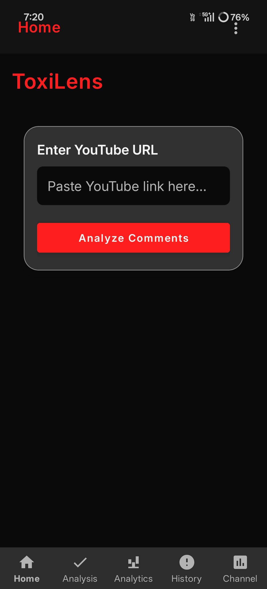

# 🛡️ YouTube Comment Toxicity Checker

An AI-powered Android application that analyzes YouTube comments for toxicity, hate speech, and offensive content using Google Gemini AI.

---

## 📱 About The App

**YouTube Comment Toxicity Checker** is a production-ready Android application that helps users identify harmful content in YouTube comment sections. Using **Google Gemini Flash 2.5 AI**, the app analyzes comments in real-time and classifies them into **Safe**, **Neutral**, or **Toxic** categories with accurate toxicity scoring.

### 🎯 Key Features

| Feature | Description |
|---------|-------------|
| 🤖 **AI-Powered Analysis** | Uses Google Gemini AI for multi-label toxicity detection |
| 📊 **Visual Analytics** | Interactive pie charts and progress bars for toxicity distribution |
| 🎨 **Color-Coded Comments** | 🔴 Toxic, 🟡 Neutral, 🟢 Safe with progress indicators |
| 🔍 **Comment Filtering** | Filter by Toxic, Neutral, or Safe categories |
| 📺 **Channel Analysis** | Analyze entire YouTube channels with statistics and trends |
| 🛡️ **Safety Score** | 0-100 safety score with color-coded warnings |
| 📈 **Toxicity Trend** | Detect if channel toxicity is increasing, decreasing, or stable |
| 🔥 **Smart Recommendations** | Personalized video suggestions based on toxicity levels |
| 👤 **User Accounts** | Email/password authentication with Firebase |
| ☁️ **Cloud Sync** | Cross-device history synchronization |
| 📜 **Analysis History** | Save and re-open previous analyses |
| ▶️ **Built-in Player** | Watch videos directly in the app |

---

## 🏗️ Architecture

┌─────────────────────────────────────────────────────────────────┐
│ MVVM Architecture │
├─────────────────────────────────────────────────────────────────┤
│ │
│ ┌──────────────┐ ┌──────────────┐ ┌──────────────┐ │
│ │ VIEW │────│ VIEWMODEL │────│ MODEL │ │
│ │ (Fragment) │ │ (MainViewModel│ │ (Repository) │ │
│ └──────────────┘ └──────────────┘ └──────────────┘ │
│ │ │ │ │
│ ▼ ▼ ▼ │
│ ┌──────────────┐ ┌──────────────┐ ┌──────────────┐ │
│ │ ViewBinding │ │ LiveData │ │ YouTube API │ │
│ │ RecyclerView│ │ Coroutines │ │ Gemini AI │ │
│ │ Canvas Chart│ │ │ │ Firebase DB │ │
│ └──────────────┘ └──────────────┘ └──────────────┘ │
│ │
└─────────────────────────────────────────────────────────────────┘

text

---

## 🛠️ Technology Stack

| Component | Technology | Version |
|-----------|------------|---------|
| **Language** | Kotlin | 1.9.20 |
| **Minimum SDK** | Android 7.0 | API 24 |
| **Target SDK** | Android 14 | API 34 |
| **Architecture** | MVVM | - |
| **Networking** | Retrofit 2 + OkHttp | 2.9.0 |
| **AI/ML** | Google Gemini Flash 2.5 | - |
| **Database** | Firebase Realtime Database | 32.8.0 |
| **Authentication** | Firebase Auth | 32.8.0 |
| **Async Processing** | Kotlin Coroutines | 1.7.3 |
| **Image Loading** | Glide | 4.16.0 |
| **UI** | Material Design 3 | - |

---

## 📸 Screenshots

| Home Screen | Analysis Screen | Analytics Screen |
|-------------|-----------------|------------------|
|  |  |  |

| Channel Analysis | History Screen | Login Screen |
|------------------|----------------|---------------|
|  |  |  |

---

## 🚀 Getting Started

### Prerequisites

- Android Studio Hedgehog | 2023.1.1 or later
- JDK 11 or later
- Android SDK with API 34
- Google Cloud account (for YouTube API)
- Firebase account

